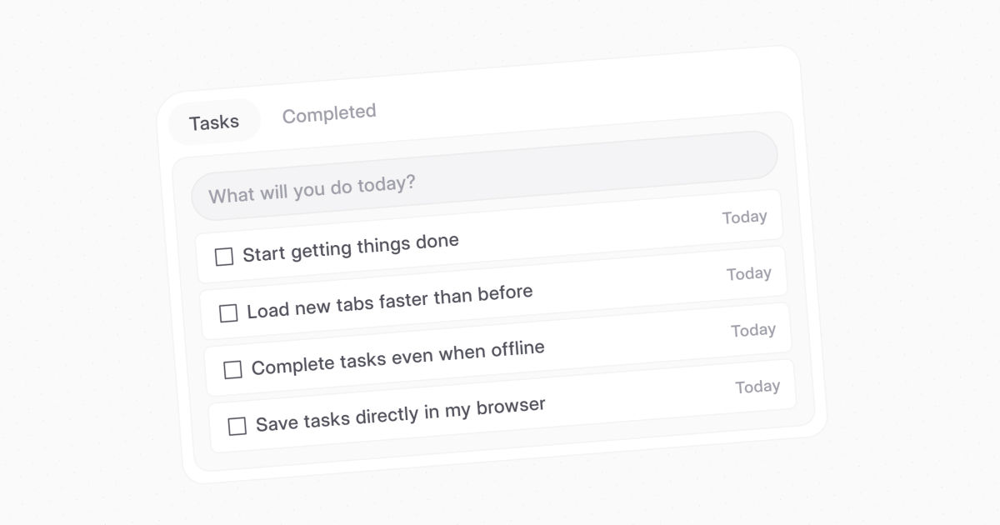

# tabcrush

> A distraction-free, minimalistic task manager that lives in every new tab.

tabcrush replaces the default new-tab page in your browser with a blazingly-fast, keyboard-first interface for capturing tasks and tracking your daily to-dos. 100 % client-side, offline-friendly, and translated into 10+ languages.

---

## Features

- **Instant capture** – start typing as soon as a new tab opens.
- **Keyboard-first UX** – navigate, complete or delete tasks without touching the mouse.
- **Light & dark themes** – auto-detect or pick manually.
- **Accessible animations** – subtle, configurable and compliant with `prefers-reduced-motion`.
- **Multi-language UI** – English, Español, Français, Deutsch, Português, 中文, 日本語, 한국어, Русский, हिन्दी (and counting!).
- **Offline-ready** – tasks are stored locally, no account required.
- **Privacy-first** – no trackers, no analytics, no external requests (except when you sync manually).

## Live demo

Try it right now at <https://www.tabcrush.com/new>

---

## Tech stack

| Aspect       | Details                                                                                                       |
| ------------ | ------------------------------------------------------------------------------------------------------------- |
| Build        | Vanilla HTML + TypeScript bundled with [Vite](https://vitejs.dev/)                                            |
| Styling      | [Tailwind CSS](https://tailwindcss.com/) processed via PostCSS                                                |
| Offline      | [`vite-plugin-pwa`](https://vite-plugin-pwa.netlify.app/) – generates Service Worker for full offline support |
| Runtime deps | None – no third-party JS libraries at runtime                                                                 |

Zero runtime dependencies → lightning-fast load (sub-20 ms).

---

## Contributing

Pull requests and issue reports are welcome!

1. Fork the repo and create your branch: `git checkout -b feature/awesome`
2. Commit your changes: `git commit -m "feat: add awesome"`
3. Push to the branch: `git push origin feature/awesome`
4. Open a Pull Request.

If you'd like to translate tabcrush into another language, edit the corresponding JSON in `public/locales/` and submit a PR.

---

## License

MIT © 2025 Daniel Calero – see the [LICENSE](LICENSE) file for details.
